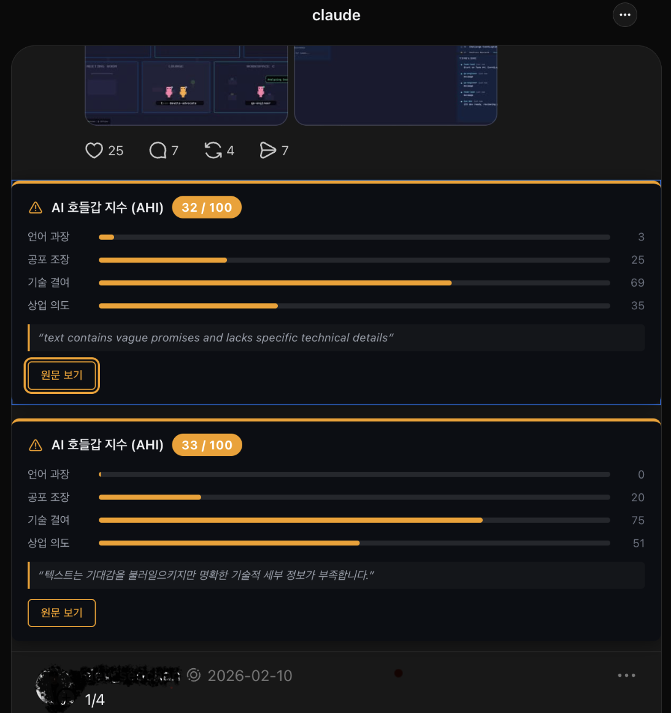
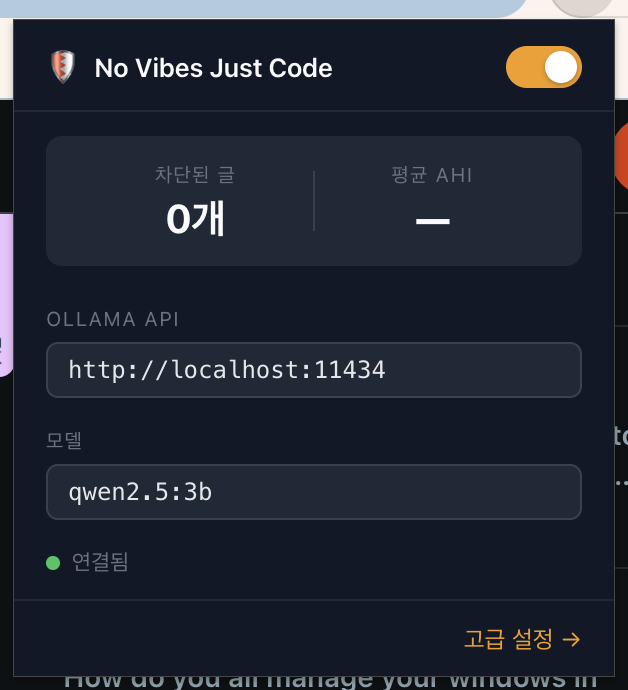
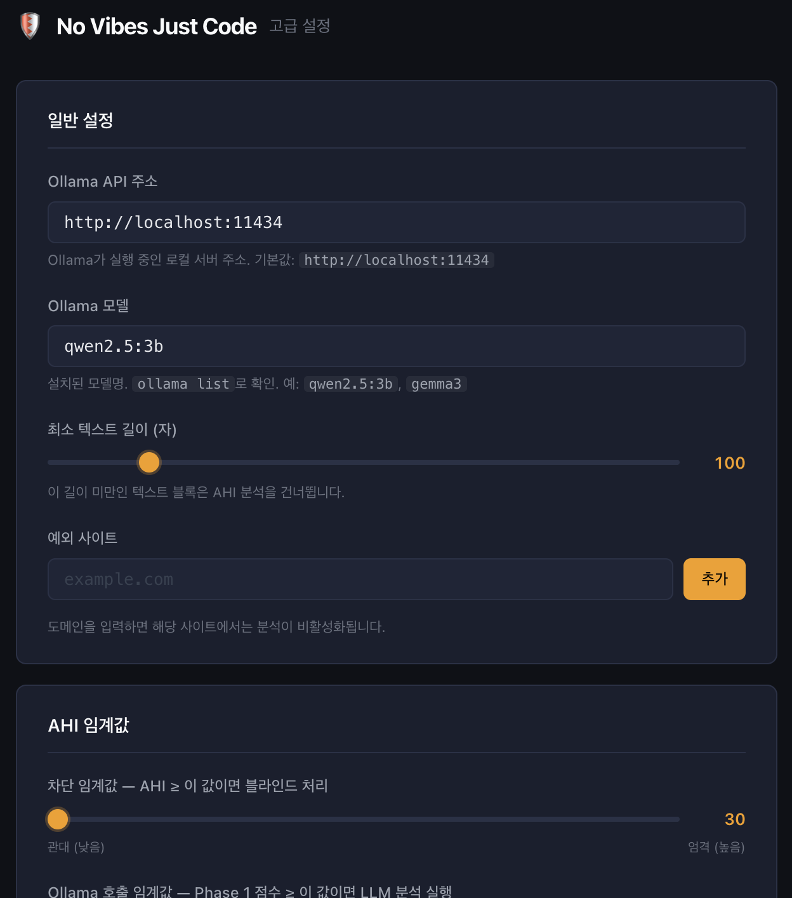

# 🛡 No Vibes Just Code

> **AI 호들갑 지수(AHI)**로 웹페이지의 AI 과장·호들갑 콘텐츠를 감지하고 블라인드 처리하는 Chrome Extension

[](https://developer.chrome.com/docs/extensions/mv3/)
[](LICENSE)

---

## 목차

1. [소개](#소개)
2. [스크린샷](#스크린샷)
3. [AI 호들갑 지수 (AHI) 모델](#ai-호들갑-지수-ahi-모델)
4. [사전 요구사항 — Ollama 설치](#사전-요구사항--ollama-설치)
5. [macOS CORS 설정 (필수)](#macos-cors-설정-필수)
6. [Chrome 확장 프로그램 설치](#chrome-확장-프로그램-설치)
7. [사용 방법](#사용-방법)
8. [설정 옵션](#설정-옵션)
9. [프로젝트 구조](#프로젝트-구조)
10. [기여하기](#기여하기)
11. [라이선스](#라이선스)

---

## 소개

**No Vibes Just Code**는 기술 뉴스·SNS·커뮤니티 사이트에 범람하는 AI 과장·허위 홍보성 콘텐츠를 자동으로 감지하고 블라인드 처리하는 Chrome 확장 프로그램입니다.

**핵심 특징:**

- 🔒 **완전 오프라인** — 분석된 텍스트가 외부 서버로 전송되지 않습니다. 로컬 Ollama만 사용.
- ⚡ **2-Phase 하이브리드 파이프라인** — 규칙 기반 Phase 1으로 불필요한 LLM 호출을 최소화.
- 👁 **뷰포트 우선 처리** — 화면에 보이는 콘텐츠부터 분석. 스크롤 전 콘텐츠는 Ollama 호출 없음.
- 📊 **AHI 점수 시각화** — 단순 차단이 아닌 4개 차원 세부 분석 결과 표시.
- 🔍 **스캔 배지** — 차단되지 않은 글도 분석 결과(AHI 점수, Ollama 사용 여부)를 배지로 표시.
- 🔄 **원문 토글** — 블라인드 처리된 글을 한 번 클릭으로 확인 가능.
- ⚙️ **완전 커스터마이징** — 차단 임계값, 가중치, 예외 사이트를 직접 설정.

---

## 스크린샷

### Threads에서 차단 처리된 예시



AHI 임계값(기본 40) 이상의 글은 자동으로 블라인드 처리되며, 4개 차원 점수와 Ollama의 판별 근거가 표시됩니다. "원문 보기"로 원본을 토글할 수 있습니다.

### 팝업 (툴바 아이콘 클릭)



현재 페이지의 차단 통계, Ollama 연결 상태(초록 점 = 연결됨), API 주소·모델 빠른 변경이 가능합니다.

### 고급 설정 페이지



차단 임계값, Ollama 호출 임계값, 4개 차원 가중치, 예외 사이트 등을 세밀하게 조정할 수 있습니다.

---

## AI 호들갑 지수 (AHI) 모델

AHI는 0~100 사이의 단일 지수로, 4개 차원을 가중합산하여 계산합니다.

```
AHI = w1·L + w2·F + w3·(1 − T) + w4·C    (×100)
```

| 기호 | 차원 | 설명 | 측정 방법 |
|------|------|------|----------|
| **L** | 언어적 인플레이션 | 최상급 표현, 이모지 남발, 과장 형용사, 출처 없는 고액 수치 | 규칙 기반 (정규식 + 키워드) |
| **F** | 공포/FOMO 유발 | 위협 언어, 긴박성, 사회적 비교, 배제감 조성 | Ollama LLM (의미 분석) |
| **T** | 기술 구체성 | 코드/전문 용어, 검증 가능한 수치, 출처 링크 | 혼합 (규칙 + LLM 평균) |
| **C** | 상업적 전환 의도 | CTA 키워드, 수익 인증, 마케팅 링크 비율 | 규칙 기반 (DOM 분석) |

**기본 가중치:** w1=0.15, w2=0.50, w3=0.20, w4=0.15

> F(공포/FOMO) 가중치가 가장 높습니다. Ollama의 의미론적 판단이 AHI의 핵심 신호입니다.

**기본 차단 임계값:** AHI ≥ 40

### Phase 1 → Phase 2 게이트 로직

```
pre = max(L, C, 1 − T_partial) × 100

pre ≥ PRE_THRESHOLD(기본 30)  →  Ollama 호출
pre <  PRE_THRESHOLD           →  Phase 1 점수만으로 AHI 계산 (기술 문서 등)
```

소셜미디어 글은 기술 내용이 없으므로 `1 − T_partial ≈ 1.0` → pre ≈ 100으로 항상 Ollama가 호출됩니다.
코드·논문·기술 문서는 T_partial이 높아 Ollama를 건너뜁니다.

### 스캔 배지 표시

차단되지 않은 글에도 분석 결과가 우측 상단에 배지로 표시됩니다:

| 배지 | 의미 |
|------|------|
| `🔍 AHI 35` | Ollama 분석 완료, AHI 35 |
| `⚡ AHI 21` | Ollama 호출 시도했지만 실패 (연결 확인 필요) |
| `· AHI 10` | 기술 문서로 판단, Ollama 스킵 |

배지 색상: 초록(AHI < 50) / 노랑(AHI ≥ 50, 임계값 미만)
배지에 마우스를 올리면 pre-score 상세 정보가 tooltip으로 표시됩니다.

---

## 사전 요구사항 — Ollama 설치

### 1. Ollama 설치 (macOS)

```bash
# Homebrew 사용
brew install ollama

# 또는 공식 사이트에서 dmg 다운로드
# https://ollama.com/download
```

### 2. 모델 다운로드

```bash
# 권장: qwen2.5:3b (M4 기준 ~1초, 한국어 지원 우수)
ollama pull qwen2.5:3b

# 더 높은 정확도가 필요하면 (M4 기준 ~3초)
ollama pull qwen2.5:7b

# 설치된 모델 확인
ollama list
```

### 3. Ollama 실행

```bash
OLLAMA_ORIGINS="chrome-extension://*" ollama serve
```

> CORS 설정 포함 실행. 아래 [macOS CORS 설정](#macos-cors-설정-필수) 섹션에서 영구 설정 방법을 확인하세요.

브라우저에서 `http://localhost:11434` 접속 시 `Ollama is running`이 표시되면 정상입니다.

---

## macOS CORS 설정 (필수)

Chrome Extension의 Background Service Worker에서 `localhost`로 요청할 때, Ollama의 기본 CORS 정책이 이를 차단합니다(`403 Forbidden`).

### 권장: .zshrc에 영구 등록

```bash
echo 'export OLLAMA_ORIGINS="chrome-extension://*"' >> ~/.zshrc
source ~/.zshrc
```

이후 새 터미널에서 `ollama serve`를 실행하면 자동으로 적용됩니다.

### 또는: 실행 시 인라인 지정

```bash
OLLAMA_ORIGINS="chrome-extension://*" ollama serve
```

**설정 확인:** Popup의 연결 상태 점이 🟢 초록이면 정상입니다.

> **주의:** `launchctl setenv`는 세션 종료 시 초기화됩니다. `.zshrc` 방식을 권장합니다.

---

## Chrome 확장 프로그램 설치

### 개발자 모드로 로컬 설치

1. **저장소 클론:**
   ```bash
   git clone https://github.com/your-username/no-vibes-just-code.git
   cd no-vibes-just-code
   ```

2. **Chrome 확장 프로그램 관리 페이지 열기:**
   `chrome://extensions/` 주소 접속

3. **개발자 모드 활성화:**
   우측 상단 "개발자 모드" 토글 ON

4. **압축 해제된 확장 프로그램 로드:**
   "압축 해제된 확장 프로그램을 로드합니다" 클릭 → `no-vibes-just-code` 폴더 선택

5. **설치 확인:**
   브라우저 주소창 우측에 🛡 아이콘이 나타나면 완료

### 코드 수정 후 반영

빌드 도구 없는 순수 Vanilla JS 프로젝트입니다. 파일 수정 후 `chrome://extensions/`에서 🔄 새로고침 버튼만 누르면 됩니다.

---

## 사용 방법

### 기본 사용

1. 분석할 웹페이지를 열면 자동으로 분석이 시작됩니다.
2. 화면에 보이는 콘텐츠부터 우선 처리됩니다 (뷰포트 우선 스캔).
3. AHI ≥ 40(기본값)이면 블라인드 처리, 미만이면 배지만 표시.

### 오버레이 조작

```
┌──────────────────────────────────────────────┐
│  ⚠  AI 호들갑 지수 (AHI)       [32 / 100]   │
│                                              │
│  언어 과장   ░░░░░░░░░░░░░░░░░░░░   3        │
│  공포 조장   ████████░░░░░░░░░░░░  25        │
│  기술 결여   ██████████████░░░░░░  69        │
│  상업 의도   ████████░░░░░░░░░░░░  35        │
│                                              │
│  "text contains vague promises and lacks     │
│   specific technical details"                │
│                                              │
│              [ 원문 보기 ]                   │
└──────────────────────────────────────────────┘
```

- **원문 보기** 클릭 → 원본 콘텐츠 표시 / **다시 숨기기**로 재차 블라인드

### Popup 활용

툴바의 🛡 아이콘을 클릭하면:
- 현재 페이지의 차단 통계 (차단된 글 수 / 평균 AHI)
- 확장 프로그램 활성화/비활성화 토글
- Ollama API 주소·모델 빠른 변경
- Ollama 연결 상태 확인 (🟢 연결됨 / 🔴 오류)

---

## 설정 옵션

확장 프로그램 아이콘 클릭 → "고급 설정 →" 으로 Options 페이지 접근

| 설정 | 기본값 | 설명 |
|------|--------|------|
| Ollama API 주소 | `http://localhost:11434` | Ollama 서버 주소 |
| 모델 | `qwen2.5:3b` | 분석에 사용할 Ollama 모델 |
| 최소 텍스트 길이 | 100자 | 이 길이 미만은 분석 스킵 |
| **차단 임계값** | **40** | AHI ≥ 이 값이면 블라인드 처리 |
| Ollama 호출 임계값 | 30 | Phase 1 pre-score ≥ 이 값이면 LLM 호출 |
| w1 (언어 인플레이션) | 0.15 | L 차원 가중치 |
| **w2 (공포/FOMO)** | **0.50** | F 차원 가중치 (핵심 신호) |
| w3 (기술 결여) | 0.20 | (1−T) 차원 가중치 |
| w4 (상업 의도) | 0.15 | C 차원 가중치 |
| 예외 사이트 | (없음) | 해당 도메인에서는 분석 비활성화 |

> **가중치 합계**는 반드시 1.00이어야 합니다. Options 페이지에서 실시간 검증됩니다.

> **기존 저장 설정 초기화:** Options 페이지 → "기본값으로 초기화" 버튼을 클릭해야 새 기본값이 적용됩니다.

---

## 프로젝트 구조

```
no-vibes-just-code/
├── manifest.json           # Manifest V3 설정
├── background.js           # Service Worker: 탭별 직렬 큐 + Phase 2 Ollama 호출
├── content.js              # Content Script: 뷰포트 우선 스캔 + 2-Phase 파이프라인
├── content.css             # 오버레이 + 스캔 배지 스타일
│
├── shared/
│   ├── constants.js        # 공유 상수 (스토리지 키, AHI 기본값, 키워드 사전)
│   ├── storage.js          # chrome.storage 래퍼
│   └── ahi-scorer.js       # Phase 1 Rule-based AHI 스코어러
│
├── popup/
│   ├── popup.html          # Popup UI
│   ├── popup.js
│   └── popup.css
│
├── options/
│   ├── options.html        # 고급 설정 페이지
│   ├── options.js
│   └── options.css
│
├── icons/
│   ├── icon16.png
│   ├── icon48.png
│   └── icon128.png
│
├── screenshots/            # README 스크린샷
│
├── PRD.md                  # 제품 요구사항 문서
└── ARCHITECTURE.md         # 소프트웨어 아키텍처 설계
```

---

## 기여하기

PR과 이슈 환영합니다!

### 기여 아이디어

- 한국어/영어 키워드 사전 품질 향상 ([shared/constants.js](shared/constants.js))
- 새로운 사이트 선택자 추가 ([content.js](content.js) `TEXT_SELECTORS`)
- AHI 스코어링 알고리즘 개선 ([shared/ahi-scorer.js](shared/ahi-scorer.js))
- 프롬프트 엔지니어링 개선 ([background.js](background.js) `buildPrompt`)
- 다국어(i18n) 지원

### 커밋 컨벤션

```
feat: 새 기능
fix:  버그 수정
docs: 문서 변경
refactor: 리팩토링
chore: 빌드/설정 변경
```

---

## 라이선스

MIT License — 자유롭게 사용, 수정, 배포하세요.

---

<p align="center">
  Made with ☕ and 0 vibes
</p>
